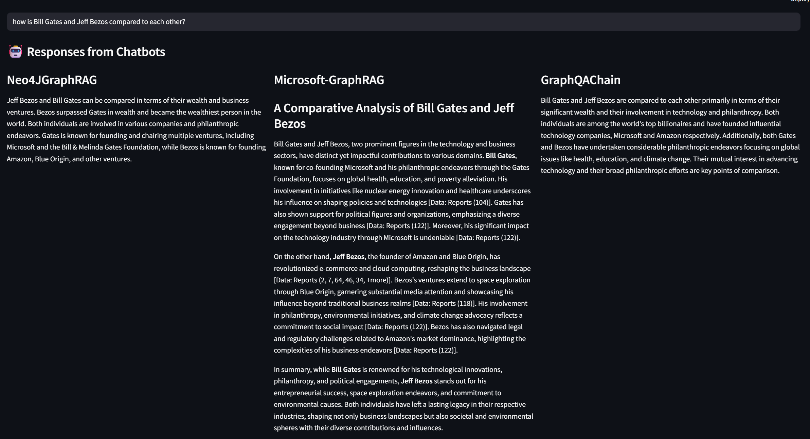

# Network Visualization with Neo4j, Gephi, and Large Language Models (LLMs)

This repository helps create graph network using LLMs and use it for RAG approaches using graph databasese for contextual reasoning and knowledge retrieval 

## Architecture

## UI

## compared Frameworks:

| Framework | Backend / Architecture | Description |
|------------|------------------------|--------------|
| **Neo4JGraphRAG** | Neo4j + LangChain/LLM | Uses Neo4j as the graph database to represent entities and relationships; integrates with an LLM for context-aware retrieval. |
| **Microsoft GraphRAG** | Microsoft Graph + Azure OpenAI | Leverages Microsoft Graph API data (e.g., documents, org networks) for LLM-powered graph retrieval and reasoning. |
| **GraphQAChain** | Custom Graph-based QA pipeline | A lightweight pipeline for graph question answering using embedded vector lookups and knowledge traversal. |

Each approach was tested in the **KnowGraph Lab** prototype (shown below), allowing natural language queries and side-by-side comparison of RAG responses.

## KnowGraph Lab Interface

Below is a snapshot of the **KnowGraph Lab**, the interactive interface built for this comparison:

**Example Query:**  
> *"Give me a list of people related to CNN"*

**System Outputs:**
- **Neo4JGraphRAG:** Retrieves entity relationships directly from a Neo4j graph DB using Cypher queries.  
- **Microsoft-GraphRAG:** Uses LLM to infer semantic links between entities covered in corporate or media data.  
- **GraphQAChain:** Performs direct question-answering over structured knowledge graphs.

This interface allows direct visualization and interpretation of how each RAG system reasons, fetches, and composes answers.

### example screenshots and graphs 

## Core Focus

- Compare **Graph-based Retrieval Architectures**
- Evaluate **Contextual Reasoning Quality**
- Assess **Query Latency and Interpretability**
- Explore **LLM-assisted Graph Traversal**

## 📰 Read the Full Article

📖 The concepts and results from this project are discussed in detail in my LinkedIn article:  
👉 [**Network Visualization with Neo4j, Gephi, and LLMs: A Modern Approach to Graph Intelligence**](https://www.linkedin.com/pulse/network-visualization-using-large-language-models-amruth-pai-fqh3c/?trackingId=1jalSTUATcuJiB%2FkVI%2Fw0Q%3D%3D)